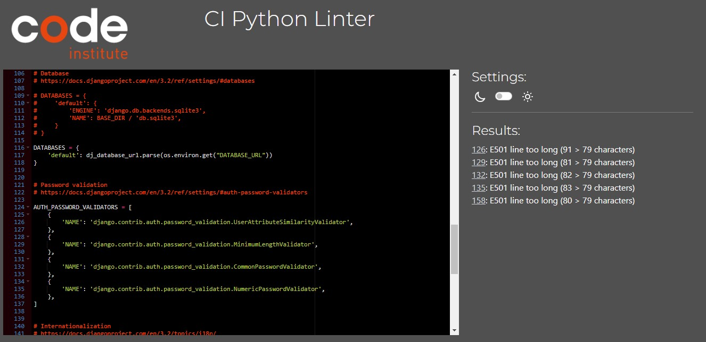

# **Time to Dine**
## **Site Overview**
For anyone who constantly finds themselves wanting to try new meals to cook, or for people that have a burning desire to share their approach to the art of cooking: Time to Dine

Time to Dine is a community recipe sharing site. The site provides an opportunity to view a list of recipes, which a viewer can select to see a more detailed view, or they can submit their own recipe for others to view, comment and rate.

[Deployed site](https://time-to-dine-0c73767650ec.herokuapp.com/)

# **Table Of Contents**
- [**Time to Dine**](#time-to-dine)
  - [**Site Overview**](#site-overview)
- [**Table Of Contents**](#table-of-contents)
- [**Planning Stage**](#planning-stage)
  - [**Target Audience**](#target-audience)
  - [**User Stories**](#user-stories)
  - [**Site Aims**](#site-aims)
  - [**Wireframes**](#wireframes)
    - [**Home Pages**](#home-pages)
    - [**Recipe Pages**](#recipe-pages)
    - [**Form Pages**](#form-pages)
  - [**Site Flow Diagram**](#site-flow-diagram)
  - [**Database model**](#database-model)
  - [**Design**](#design)
- [**Agile Development Process**](#agile-development-process)
  - [**Overview**](#overview)
  - [**Sprint 1 Notes**](#sprint-1-notes)
    - [**Sept. 1st**](#sept-1st)
    - [**Sept. 3rd**](#sept-3rd)
    - [**Sept. 5th**](#sept-5th)
    - [**Finished User Stories**](#finished-user-stories)
  - [**Sprint 2 Notes**](#sprint-2-notes)
    - [**Sept. 6th**](#sept-6th)
    - [**Sept. 7th**](#sept-7th)
    - [**Sept. 8th**](#sept-8th)
    - [**Sept. 9th- 10th**](#sept-9th--10th)
    - [**Finished User Stories**](#finished-user-stories-1)
  - [**Sprint 3 Notes**](#sprint-3-notes)
    - [**Sept. 10th**](#sept-10th)
    - [**Sept. 11th**](#sept-11th)
    - [**Sept. 14th**](#sept-14th)
    - [**Sept. 15th**](#sept-15th)
    - [**Sept. 17th**](#sept-17th)
    - [**Finished User Stories**](#finished-user-stories-2)
  - [**Sprint 4 Notes**](#sprint-4-notes)
    - [**Sept. 17th - 23rd**](#sept-17th---23rd)
    - [**Sept. 25th**](#sept-25th)
    - [**Finished User Stories**](#finished-user-stories-3)
- [**Features**](#features)
  - [**Multiple Pages**](#multiple-pages)
    - [**Navbar**](#navbar)
      - [**Default**](#default)
      - [**Signed Out**](#signed-out)
      - [**Signed In**](#signed-in)
      - [**Hamburger Icon**](#hamburger-icon)
    - [**Messages**](#messages)
      - [**Signing In, Up or Out**](#signing-in-up-or-out)
      - [**Commenting**](#commenting)
    - [**Hero Image**](#hero-image)
    - [**Default Image**](#default-image)
    - [**Footer**](#footer)
  - [**Home Page**](#home-page)
    - [**Recipe Cards**](#recipe-cards)
    - [**Paginate Link**](#paginate-link)
    - [**Links to other pages**](#links-to-other-pages)
  - [**Categories Pages**](#categories-pages)
  - [**Recipe Form Pages**](#recipe-form-pages)
    - [**Add Recipe Page**](#add-recipe-page)
      - [**Unique Title**](#unique-title)
      - [**Required**](#required)
      - [**Ingredients comma separation**](#ingredients-comma-separation)
      - [**Instructions**](#instructions)
      - [**Unauthorised**](#unauthorised)
    - [**Update Recipe Page**](#update-recipe-page)
    - [**Submit/Delete Recipe Pages**](#submitdelete-recipe-pages)
      - [**Author Only**](#author-only)
  - [**Recipe Page**](#recipe-page)
    - [**Viewer Contribution**](#viewer-contribution)
      - [**Comments**](#comments)
      - [**Commenting**](#commenting-1)
      - [**Star Rating**](#star-rating)
      - [**Restricted Access**](#restricted-access)
  - [**My Recipes Page**](#my-recipes-page)
    - [**Recipe Status**](#recipe-status)
  - [**AllAuth Pages**](#allauth-pages)
    - [**Sign Up:**](#sign-up)
    - [**Sign In:**](#sign-in)
    - [**Logout:**](#logout)
  - [**Error Pages**](#error-pages)
    - [**Error 404:**](#error-404)
    - [**Error 500:**](#error-500)
- [**Future Development**](#future-development)
- [**Testing Phase**](#testing-phase)
  - [**Bugs**](#bugs)
    - [**Unresolved Bugs**](#unresolved-bugs)
  - [**Verifiers**](#verifiers)
    - [**HTML**](#html)
      - [**base.html**](#basehtml)
      - [**index.html**](#indexhtml)
      - [**recipe\_page.html**](#recipe_pagehtml)
      - [**my\_recipes.html**](#my_recipeshtml)
      - [**add\_recipe.html**](#add_recipehtml)
      - [**submit\_recipe.html**](#submit_recipehtml)
      - [**update\_recipe.html**](#update_recipehtml)
      - [**delete\_recipe.html**](#delete_recipehtml)
      - [**signup.html**](#signuphtml)
      - [**login.html**](#loginhtml)
      - [**logout.html**](#logouthtml)
      - [**404.html**](#404html)
      - [**500.html**](#500html)
  - [**CSS**](#css)
  - [**Python**](#python)
  - [**LightHouse**](#lighthouse)
    - [**Home Page**](#home-page-1)
    - [**Recipe Page**](#recipe-page-1)
    - [**My recipes Page**](#my-recipes-page-1)
    - [**Categories Page**](#categories-page)
    - [**Add Recipe Page**](#add-recipe-page-1)
    - [**Submit Recipe Page**](#submit-recipe-page)
    - [**Update Recipe Page**](#update-recipe-page-1)
    - [**Delete Recipe Page**](#delete-recipe-page)
    - [**Register Page**](#register-page)
    - [**Login Page**](#login-page)
    - [**Logout Page**](#logout-page)
  - [**Manual Testing**](#manual-testing)
- [**Deployment**](#deployment)
  - [**Files to be created**](#files-to-be-created)
  - [**Resources**](#resources)
  - [**Config Vars**](#config-vars)
  - [**Deployment Steps**](#deployment-steps)
- [**Technologies Used**](#technologies-used)
- [**Honourable Mentions**](#honourable-mentions)
- [**Credits**](#credits)

# **Planning Stage**
## **Target Audience**

- People who are new to cooking and want to find recipes tailored for beginners
- Experienced cooks who want to share their recipes online
- People who want to cook something precise, such as bread, cake, pasta and want a list of choices that fall within these categories
  
## **User Stories**

- As a site user, I can view a paginated list of posts so that I can easily select a recipe that catches my interest.
- As a site user, I can open a post so that I can see what ingredients and steps I need to take to prepare a recipe.
- As a site user/admin, I can see a rating of 1 to 5 stars on each post so that I can see which recipes are the most popular.
- As a site user, I can see the difficulty rating of a recipe on a post so that I can gauge whether or not I am skilled enough to prepare this recipe.
- As a site user/admin, I can view the comments on a post so that I can see other people's opinions of a recipe.
- As a site user, I can see the estimated time required to prepare a certain recipe so that I can determine whether I have enough time or plan my cooking schedule ahead.
- As a site user, I can register for an account so that I can comment and review other people's recipes, as well as post my own ones.
- As an admin, I can approve submitted recipes so that they can be viewed and enjoyed by the site users.
- As a site user, I can leave a comment so that I can be a part of the conversation regarding a particular recipe.
- As a site user, I can submit a review of 1-5 stars so that I can help other people decide whether they want to prepare this recipe themselves.
- As a site admin, I can create, read, update, and delete posts so that I can manage the site's content.
- As a site user, I can update and delete my own recipes so that I can correct or erase any mistakes I have made in my recipes.
- As a site user/admin, I can create draft posts so that I can finish writing the recipe later.
- As a site user, I can click on a link to a step-by-step guide so that I can follow the recipe instructions clearly.
- As a site user, I can select a particular category of food so that I can see a list of recipes that match the category of food I want to cook.
- As a user, I can see how many portions a recipe serves so that I can plan how much I need to prepare according to the number of people I will be cooking for.

The user stories made up a big part of the user design for the website and were carried out via agile methodology.

One user story, instructions, was reinterpreted to include the instructions on the recipe's main page as opposed to being on their own separate view.

## **Site Aims**

The Time to Dine site had two main goals:

1. To provide an online hub wherein people can find a cooking recipe
2. To provide a place for people to share their own recipes on the internet in a stylish and sleek format.

## **Wireframes**

In order to conceptualise how the pages would display, I used Balsamiq to create some wireframes.

### **Home Pages**

Since the very beginning, the Time to Dine site would feature a large hero image to welcome the user, followed by a the most recently posted meals.

And since the categories page would essentially filter the recipes down to recipes that were listed under that category, the categories page remained more or less the same, just with a different h1 header.

With regards to displaying the recipes the user had created, they would also display in a paginated format, however the image and stars would be replaced by buttons allowing the user to edit or delete their recipe. (The decision to add a pending/published status box hadn't been thought of at the time.)

### **Recipe Pages**

The recipe pages would feature a large image of the author's own choice, followed by the title, the date it was posted, followed by a star rating determined by the average rating posted by other users. It would also allow the user to view comments posted on that particular page.

### **Form Pages**

On pages which featured creating/editing a new recipe or logging in/out, the form pages would have displayed in this format.

The create new recipe page has conceptually remained the same, although the recipe category radio field was replaced with a dropdown select field instead in later development.

The login, and register pages have remained the same since their inception

## **Site Flow Diagram**

The following diagram demonstrates how a user might have navigated through this website.  The most crucial factors that came to mind in the designing of this flow chart was the consideration of whether or not a user should or should not have permission to view a recipe page. This is illustrated in the chart and is inherited in the actual final website.

## **Database model**

The Database was rather simple, involving two classes: Recipe and Comment as shown in this diagram.

However, as I had a determination to inlcude a star rating system, the database had to be altered to allow for a new model Class called Rating

Both of these models were created using drawSQL.app

The Recipe model also has a def: average_star_rating, which calculates the average star rating of a recipe.

## **Design**

Because the users are able to post their own photos onto the website, I chose to have as simple colour palate so that the site wouldn't clash with a random user selected photo.

The sole colour that is used consistently throughout the site is Bootstrap 5's 'Success' Colour (#14A44D), and is used for anchor links, recipe card titles, and even the navbar. I chose the colour green, because I wanted to imply a notion of healthiness as soon as the page was opened.

A hero image is also made use of in the 'home page, the 'my recipes' page, and the 'category' page(s).
It was chosen for it's open centre to allow for h1 and h2 tags, but also showing a variety of tasty and inviting ingredients.

And the footer, which has a distinct but not distracting grey (#212529).

# **Agile Development Process**

## **Overview**

I used GitHub Pages to store my Agile milestones in order to better organise my work. 
Each milestone was centered around a previously created User Story, which, when being developed, would be added in the 'In Progress' tab until finally being moved to the 'Done' tab.
This was mainly the case, besides two exceptions, which will be discussed later.

## **Sprint 1 Notes**

This sprint was focused on the setting up the foundation for the Time to Dine project and menu app, followed by setting up the correct config vars. Additionally, the design stage took place where the database relationship diagram, wireframes and site flow diagram were created.

### **Sept. 1st**

- timetodine and and menu apps were created.
- ElephantSQL and Cloudinary config vars were set up in the heroku settings.
  
### **Sept. 3rd**

- Wireframes Created
- Relationship Diagram Created

### **Sept. 5th**

- Site Flow Diagram Created

### **Finished User Stories**

N/A

## **Sprint 2 Notes**

This sprint was focused on the development and rendering of the Recipe Class entities. Additionally, since admin approval was required for recipes to even be rendered to the site, I decided that user stories involving admin recipe/comment approval and admin viewing should take precedence.

### **Sept. 6th**

- Recipe and Comment classes were added to models.py and admin.py
- RecipeList cass view added to views.py
- Blank base.html created

### **Sept. 7th**

- Navbar and footer added to the base.html
- index.html created and linked to views.py
- Recipe Page class view added to views.py

### **Sept. 8th**

- Renders recipe names and recipe author names ina forloop in the index.html view.
- Renders the recipe difficulty and time to prepare

### **Sept. 9th- 10th**

- Creates recipe_page view
- Renders recipe image, ingredients and instructions to the recipe_page view.
- Displays comments on recipe_page view.

### **Finished User Stories**

- As a site user, I can view a paginated list of posts so that I can easily select a recipe that catches my interest.
- As a site user, I can open a post so that I can see what ingredients and steps I need to take to prepare a recipe.
- As a site user, I can see the difficulty rating of a recipe on a post so that I can gauge whether or not I am skilled enough to prepare this recipe.
- As a site user/admin, I can view the comments on a post so that I can see other people's opinions of a recipe.
- As a site user, I can see the estimated time required to prepare a certain recipe so that I can determine whether I have enough time or plan my cooking schedule ahead.
- As a site user, I can click on a link to a step-by-step guide so that I can follow the recipe instructions clearly.
- As a user, I can see how many portions a recipe serves so that I can plan how much I need to prepare according to the number of people I will be cooking for.

- As a site admin, I can create, read, update, and delete posts so that I can manage the site's content.
- As an admin, I can approve submitted recipes so that they can be viewed and enjoyed by the site users.

## **Sprint 3 Notes**

This sprint was focused on the authorised user aspects of the site, namely allowing the user to have access to parts of the website that are specific to logged in users, namely posting one's own recipe and leaving comments.

### **Sept. 10th**

- Installs allauth and creates the register, login and logout pages.

### **Sept. 11th**

- Adds styling to the auth pages.
- Adds commenting functionality to the recipe_page view so that logged in users can leave comments on the page.

### **Sept. 14th**

- Adds post recipe functionality

### **Sept. 15th**

- Creates the my_recipes view, allowing the user to view their approved, posted recipes.
- Ensures that unnaproved recipes can only be viewed by the author.

### **Sept. 17th**

- In the my_recipes view, Submit, Edit, and Delete buttons are added to each recipe card. If the recipe has been submitted, the submit button is replaced with a Pending/Approved status bar to display whether a recipe has been approved by an admin or not.
- Creates update and submit recipe views, and ensures that only users who are the recipe owner can submit or edit a recipe.

### **Finished User Stories**

- As a site user, I can register for an account so that I can comment and review other people's recipes, as well as post my own ones.
- As a site user, I can leave a comment so that I can be a part of the conversation regarding a particular recipe.
- As a site user, I can update and delete my own recipes so that I can correct or erase any mistakes I have made in my recipes.
- As a site user/admin, I can create draft posts so that I can finish writing the recipe later.

## **Sprint 4 Notes**

This sprint focussed on the styling of the pages as well as the implementation of a star rating system, which calculated the average rating of a recipe posted by all users.

### **Sept. 17th - 23rd**

- During this period, I spent quite a long time researching and implementing a star rating system.
- Adds alert messages to notify the user whether any form they submit was submitted successfully.

### **Sept. 25th**

- Adds recipe category page, so that users can filter recipes by category.

### **Finished User Stories**

- As a site user, I can select a particular category of food so that I can see a list of recipes that match the category of food I want to cook.
- As a site user/admin, I can see a rating of 1 to 5 stars on each post so that I can see which recipes are the most popular.
- As a site user, I can submit a review of 1-5 stars so that I can help other people decide whether they want to prepare this recipe themselves.

# **Features**

## **Multiple Pages**

### **Navbar**

#### **Default**

By default, the navbar will always display links for the following, since these links do not require a user to be authenticated:

- The Home Page
- The Categories Dropdown Links

Should a user be on one of any of the pages found on the navbar, it'll appear as active.

#### **Signed Out**

Should a user be signed out, links to the register and login pages will be displayed.

#### **Signed In**

Once signed in or registered, the navbar will instead display links to the 'Add New Recipe', 'My Recipes', and Logout pages.

#### **Hamburger Icon**

Should a user be using a viewport with a width below 768px, the navbar's contents will be replaced with a hamburger icon.

### **Messages**

Should a user perform a certain type of action, a message will diplay as an alert.

#### **Signing In, Up or Out**

Signing in, up or out will, in fact, display a message at the top of the home page for 3 seconds.

#### **Commenting**

If a user leaves a comment, a message will display at the top of the recipe page for 3 seconds.

### **Hero Image**

I chose this particular image to get the user excited about what they could eventually end up cooking, whilst also having a nice open center to add h1 tags into to display the site page name.

### **Default Image**

This image was chosen in case a user submits a recipe, but doesn't have or doesn't want to submit a recipe image. It was chosen to give the user an idea of a good meal but without showing any particular food in general.

### **Footer**

The footer contains my name(copyrighted), and a fake email and phone number. Instead of actually being there for contact me purposes, it is meant to give off a 'website-terminates-here' sense in the user.

## **Home Page**

### **Recipe Cards**

These serve as a small indicator of what an author's recipe might include and draw the user's attention. Features include: 

- A user submitted photo
- A title,
- A difficulty
- A 5 star rating
- Portion size
- The number of minutes it takes to prepare the meal.

These features are included to give both practical, realistic chefs, as well as hungry and excitable-about-food-foodies the information they need to narrow down their choices.

### **Paginate Link**

When there are more than 6 recipe cards on the main page, a link will appear at the bottom of the list of cards giving the user the option to cycle through some more recipes.

### **Links to other pages**

Should the user not be logged in, they'll be shown links to the register and login pages across the hero image.

Should they be logged in, however, they'll see a link to the 'add recipe' page.

## **Categories Pages**

The Categories Pages all use the same template as the Home Page, the only difference being that they will only display recipes that have a matching recipe category as the one specified by the user.

## **Recipe Form Pages**

The following pages both make use of the Recipe Form to allow to users to post their own recipes to the database.

### **Add Recipe Page**

This page offers the user a blank form and allows them to fill it with their own recipe title, featured image, instructions and ingredients etc.

#### **Unique Title**

Since the recipe's url slug is created through the user inputted title, the user must always supply a unique recipe title.

#### **Required**

Some sections of the form, such as title, ingredients and instructions are required and are marked with an asterisk (*).

Except for the Image section, which is not required by design, but (for some reason I was not able to figure out!) still has an asterisk.

#### **Ingredients comma separation**

The form (politely) requests that the user separate their ingredients with commas. Should the user do this, the string submitted by the user will be separated into an array of ingredients for the recipe.

#### **Instructions**

The instructions panel has a summernote widget which allows the user to get a bit more creative when tediously writing out their recipe instructions. When the recipe page loads, the html is rendered safe.

#### **Unauthorised**

A user must be signed in to post a recipe, so if a user who is not signed in (somehow) finds there way to this page, this message will be displayed.

### **Update Recipe Page**

The update form page has exactly the same layout, except that it is all prepopulated with the user's requested recipe's data. It can be edited only by that user.

### **Submit/Delete Recipe Pages**

The Submit and Delete Recipe Pages also make use of forms, however, they are more to make sure the user is aware of the nature of what they are doing.

#### **Author Only**

Should a user arrive on a submit, update, or delete page that they are not the author of, they will be politely shown a link back to the home page.

## **Recipe Page**

The recipe page displays a more complete detail of the information regarding a particular recipe.

### **Viewer Contribution**

#### **Comments**

If a viewer is not authorised, then besides the recipe's main data, the only other feature they'll have access to is the comments view.

#### **Commenting**

One of the restricted features is the commenting form. Should a user successfully post a form, it'll be submitted for review by an admin. If it's approved, it'll appear in the recipe's comment section.

#### **Star Rating**

Another restricted feature is the ability to leave a 5 star review on a recipe's page. Once submitted, it'll remember your submitted review and keep it on display if you visit the page again. It will also contribute to the recipe's average star rating.

#### **Restricted Access**

If a recipe has not been approved by an admin, or submitted by an author as published, then it can only be viewed by the original author.

If it is not submitted as published then it'll appear to the author as a draft.

## **My Recipes Page**

The 'my recipes' page displays all of a user's posted recipes.

### **Recipe Status**

Depending on the status of the user's posted recipes, the button on the bottom left will change to the appropriate status. The three options being ready to submit, pending approval, and approved.

## **AllAuth Pages**

### **Sign Up:**

### **Sign In:**

### **Logout:**

## **Error Pages**

### **Error 404:**

### **Error 500:**

# **Future Development**

- A javascript function that automatically cycles through recipe cards in the Home and Categories Pages
- A list of preloaded images so the user can choose a matching image so that they don't have to download one themselves when submitting a recipe.
- A wider community with a more full database
- More inclusive food groups so that they don't all have to be lumped into one 'Other' category.
- Send an automatic email to an author when they recieve a comment that has been approved by a site admin.

# **Testing Phase**

## **Bugs**

Issue - When performing initial commit to Heroku, none of the static files would load up.
Cause - The ALLOWED_HOSTS parameter in the settings.py file hadn't parsed the Heroku URL, so it was not displaying.
Fix - Simply by adding the Heroku site URL, the django deployment page displayed.

Issue - The Difficulty Feature was only displaying the initial letters of the difficulty selected by the user: B for beginner, I for intermediate etc.
Cause - The Recipe Model's DIFFICULTY_CHOICES had been preselected a data-value equal to just a single character to be passed into the CharField. This single letter value was then being displayed on the Home Page's recipe cards.
Fix - By changing the RECIPE_CHOICES values in the Recipe model, to full words and increasing the max_length to a higher value, the difficulty displayed normally.

Issue - The Instructions section on the Recipe Page were displaying the HTML code that was being passed into the database.
Cause - This was because when the template was calling that data info directly from the database without using the {{ | safe }} tag.
Fix - By adding the tag to the recipe_page.html file, the instructions section was now loading the ul elements properly and not literally.

Issue - The hero image wasn't loading when called being passed a  tag into an href.
Cause - Despite having a  tag in the base.html, which was sufficient to call CSS stylings across all pages, it had to be written yet again in the relevant templates.
Fix - Once the  tags had been added to the index.html and the my_recipes.html files, the image loaded just perfectly.

Issue - After making migrating the newly updated Recipe model, an error Cause - Because the pre-existing data in the database didn't have any such column of data, along with no default value, the whole site wouldn't run properly.
Fix - By starting my elephantSQL database from scratch and applying my new model directly to that empty database, I was able to continue with my development.

Issue - The SummerNote widget on the Recipe Form would remain the same size, even when shrunk down to s smaller window media.
Cause - It appeared that the widget's batteries included styling had a set max-width using px and not rem or em.
Fix - By targeting the affected fields using HTML and CSS, I was able to overwrite the troublesome styling.

### **Unresolved Bugs**

The Recipe Form's image section still has an asterisk above it, even though that section is, by design, not required.

## **Verifiers**

### **HTML**

The HTML validators were flagging the use of django tags such as: .

For the sake of clarity, I will ignore and hide these flags.

#### **base.html**

#### **index.html**

#### **recipe_page.html**

The recipe page did flag one warning, stating that the h2 heading was empty.

But this is because inside the heading are the Rating Stars.

#### **my_recipes.html**

#### **add_recipe.html**

#### **submit_recipe.html**

#### **update_recipe.html**

#### **delete_recipe.html**

#### **signup.html**

#### **login.html**

#### **logout.html**

#### **404.html**

#### **500.html**

## **CSS**

## **Python**

Using Code Institute's Python Linter, I was able to assure that there were no serious problems in my python files' code.

However, in the settings.py and the env.py files, there was no way to avoid some lines being over 79 chars long.

## **LightHouse**

### **Home Page**

### **Recipe Page**

### **My recipes Page**

### **Categories Page**

### **Add Recipe Page**

### **Submit Recipe Page**

### **Update Recipe Page**

### **Delete Recipe Page**

### **Register Page**

### **Login Page**

### **Logout Page**

## **Manual Testing**

Below is a summary of how I manually tested each user story.

| Checked | ...**As a site user, I can view a paginated list of posts so that I can easily select a recipe that catches my interest.** |
|:-------:|:--------|
| &check; | Can go to the main home page and see a list of recipes that are descending by  |

| Checked | ...**As a site user, I can open a post so that I can see what ingredients and steps I need to take to prepare a recipe.** |
|:-------:|:--------|
| &check; | Can Click onto a link and be succesfully brought to a recipe page |
| &check; | Recipe's ingredients and instructions display correctly |

| Checked | ...**As a site user/admin, I can see a rating of 1 to 5 stars on each post so that I can see which recipes are the most popular.** |
|:-------:|:--------|
| &check; | On admin page, I can click onto a panel which shows how many ratings have been awarded to which recipes |
| &check; | On the recipe card, and on the recipe page, the average 5 star rating is clearly displayed |

| Checked | ...**As a site user, I can see the difficulty rating of a recipe on a post so that I can gauge whether or not I am skilled enough to prepare this recipe.** |
|:-------:|:--------|
| &check; | On the recipe card, and on the recipe page, the recipe's difficulty is clearly displayed |

| Checked | ...**As a site user/admin, I can view the comments on a post so that I can see other people's opinions of a recipe.** |
|:-------:|:--------|
| &check; | On the recipe page, the recipe's comments can be viewed by both annonymous and logged in users |
| &check; | On the admin page, there is a Comments panel which shows who has said what comment, on what recipe, and whether it has been approved or not|

| Checked | ...**As a site user, I can see the estimated time required to prepare a certain recipe so that I can determine whether I have enough time or plan my cooking schedule ahead.** |
|:-------:|:--------|
| &check; | On the recipe page, the recipe's time to prepare in minutes can is clearly displayed |

| Checked | ...**As a site user, I can register for an account so that I can comment and review other people's recipes, as well as post my own ones.** |
|:-------:|:--------|
| &check; | User can register for an account on the sign up page, which, in turn gives them access to the features reserved only for authorised users |

| Checked | ...**As an admin, I can approve submitted recipes so that they can be viewed and enjoyed by the site users.** |
|:-------:|:--------|
| &check; | From the admin panel, admins can look at a recipe's posted data, decide whether it is appropriate or not, and either approve or delete the recipe |

| Checked | ...**As a site user, I can leave a comment so that I can be a part of the conversation regarding a particular recipe.** |
|:-------:|:--------|
| &check; | Assuming a user is authorised, they can post a comment on a recipe's page, which, when authorised, will display to the recipe's comment section |

| Checked | ...**As a site user, I can submit a review of 1-5 stars so that I can help other people decide whether they want to prepare this recipe themselves.** |
|:-------:|:--------|
| &check; | Assuming a user is authorised, they can post a 5 star rating on a recipe's page, which will then become a factor when determining the recipe's average rating |

| Checked | ...**As a site admin, I can create, read, update, and delete posts so that I can manage the site's content.** |
|:-------:|:--------|
| &check; | From the admin panel, the admin is capable of creating, viewing, changing or deleting any recipe, comment or rating that they wish |

| Checked | ...**As a site user, I can update and delete my own recipes so that I can correct or erase any mistakes I have made in my recipes.** |
|:-------:|:--------|
| &check; | The author of a recipe can change their recipe at any time, whether it is published or not, AND it will reset their approval and published statuses to False and 0 respectively. |
| &check; | The author of a recipe can delete their recipe at any time, and it will be removed from the database. |

| Checked | ...**As a site user/admin, I can create draft posts so that I can finish writing the recipe later.** |
|:-------:|:--------|
| &check; | Before submitting a recipe, the draft recipe page is available for the author, and only the author to view. |

| Checked | ...**As a site user, I can click on a link to a step-by-step guide so that I can follow the recipe instructions clearly.** |
|:-------:|:--------|
| &check; | By clicking on a recipe's card, the user will be brought to the recipe's page, which includes a section dedicated to the instructions. |

| Checked | ...**As a site user, I can select a particular category of food so that I can see a list of recipes that match the category of food I want to cook.** |
|:-------:|:--------|
| &check; | By clicking on the categories found in the navbar, the user will be brought to a list of recipes matching that category |

| Checked | ...**As a user, I can see how many portions a recipe serves so that I can plan how much I need to prepare according to the number of people I will be cooking for.** |
|:-------:|:--------|
| &check; | On the recipe card, and on the recipe page, the recipe's portion servings is clearly displayed |

# **Deployment**

## **Files to be created**

- An env.py file was used during development to keep all environ variables safely hidden from commits.
- requirements.txt was used to store all of the projects dependencies.
- .gitignore: This file was used to keep certain files from being commited to GitHub, the most important being the env.py file.

## **Resources**

- ElephantSQL was used for a database. To set up the database, Django's "python manage.py migrate" command was used. To create super users, Django's "python manage.py createsuperuser" was used.
- Cloudinary was used to store images posted by the user for their recipe posts.

## **Config Vars**

- When deployed to heroku, the CLOUDINARY_URL, DATABASE_URL, PORT, and the SECRET_KEY, config vars were implemented and remain hidden.
- An additional config var, HEROKU_POSTGRESQL_AMBER_URL, was automatically created and hasn't been changed.

## **Deployment Steps**

- I linked my Heroku project to my github repository
- I created the matching config vars
- I added the heroku url to the allowed hosts in settings.py and deployed the website successfully.

The fully deployed site can be found here on Heroku [here](https://time-to-dine-0c73767650ec.herokuapp.com/)

# **Technologies Used**

* BootStrap 5.0.1: Used as a quick method of having some styling in the early stages of the project.
* CSS: Used to adjust some of Bootstrap-5's inherited styling.
* Django: Used as the python framework.
* Django AllAuth: sign in, sign up, sign out.
* ElephantSQL: Used to host the database for this site, also elephants rule!
* FontAwesome: Used for icons in the website.
* Heroku: Finished site deployed to Heroku
* HTML5: Used to write the skeleton of the templates.
* JavaScript: Used to make the messages fade away after 3 seconds, and to post the star ratings on the recipe page.

# **Honourable Mentions**

- Richard Wells - A fantastic mentor, who, when I feel I'm about to push him over the edge with my hopelessness, he always finds a way to make my issues just disappear.
- Hayley Parsons - An assistant manager I'm really lucky to have, those extra hours off really gave me the time I needed to get this project looking nice and cool.
- Lily and Tom Lamont - A couple interested in cooking who, inadvertantly gave me the idea for this site, and without them, I'd certainly not have looked up so many nice dinner recipes.
- Timur Bakibayev, Ph.D. - Thank you for your amazingly simple and simply amazing page detailing your Star Rating system. Without your explanation, I think I might have nearly given up on rating, and not have been half as happy with my final project. His page can be viewed [here](https://medium.com/geekculture/django-implementing-star-rating-e1deff03bb1c).

# **Credits**

* The site was developed using codeanywhere.
* My site was saved to GitHub.
* Responsive screenshot made using [websitemockupgenerator.com](https://websitemockupgenerator.com/)
* Images:
  * Hero image and Default Image were taken from [pixabay.com](https://pixabay.com/)
* General references:
    * [Stack Overflow](https://stackoverflow.com/)
    * [Code Institute Learning Platform](https://codeinstitute.net/)
    * [Django Documentation](https://docs.djangoproject.com/en/3.2/)
    * [Bootstrap Documentation](https://getbootstrap.com/)
* Several recipes were acquired from [BBC Food](https://www.bbcgoodfood.com/)
